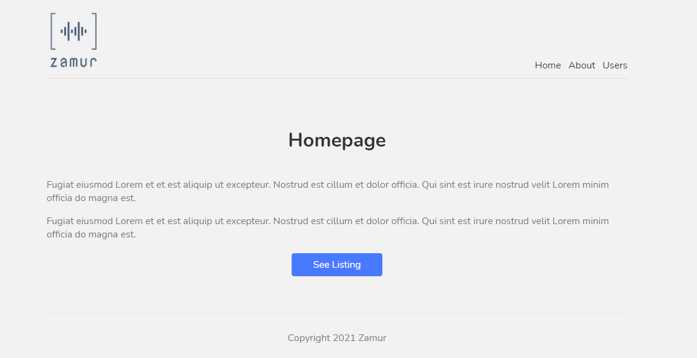

## Next.js Tutorial

### What was done

* linking pages
* wrapper layout component
* styled modules
* custos 404 page
* adding images
* adding metadas
* fetching data (getStaticProps)
* dynamic routes
* fetching single items (getStaticPaths)
* deploying to Vercel

### Deployed version

Demo deployed on Vercel [`here`](https://nextjs-tutorial-rho-ten.vercel.app/).